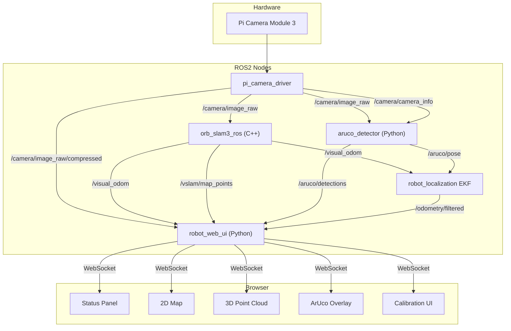

# Localization System -- User Guide & Developer Reference

## Overview

The delivery robot uses a sensor fusion approach for indoor localization:

1. **ORB-SLAM3** provides continuous visual odometry (relative motion tracking)
2. **ArUco markers** provide periodic absolute position fixes (drift correction)
3. **robot_localization EKF** fuses both into a single smooth pose estimate
4. **Web UI** visualizes everything in real-time

---

# Part A: User Guide

## Running the Localization Stack

The localization stack runs separately from the base system:

```bash
# Terminal 1: Base system (camera, motors, web UI)
cd ~/ros2_ws && ./start_robot.sh

# Terminal 2: Localization (ORB-SLAM3 + ArUco + EKF)
source /opt/ros/jazzy/setup.bash && source ~/ros2_ws/install/setup.bash
ros2 launch delivery_robot_bringup localization.launch.py

# Without ArUco (VSLAM-only mode)
ros2 launch delivery_robot_bringup localization.launch.py use_aruco:=false
```

Once both are running, open `http://<pi-ip>:8080` to see the localization dashboard.

## Camera Calibration (via Web UI)

Accurate calibration is critical for both VSLAM and ArUco pose estimation.

**Requirements:**
- A printed checkerboard pattern: 9x7 inner corners (10x8 squares), 25mm square size
- Camera node running with `publish_raw: true` (default in current config)

**Steps:**

1. Open the web UI at `http://<pi-ip>:8080`
2. In the **Localization Status** panel, click **Calibrate Camera**
3. Hold the checkerboard in front of the camera
4. The overlay will show detected corners in rainbow colors when the pattern is found
5. Move the checkerboard slowly -- vary position, angle, and distance (30cm to 1m)
6. The frame counter shows progress (e.g., "12/20")
7. A frame is auto-captured every ~0.5 seconds when the pattern is detected
8. After 20 frames, calibration runs automatically and saves the result
9. The UI shows the **RMS reprojection error** (good: < 0.5, acceptable: < 1.0)
10. Rebuild `delivery_robot_bringup` and restart to use the new calibration

**Tips for a good calibration:**
- Cover all regions of the image (center, corners, edges)
- Include tilted views (30-45 degrees)
- Vary distance: some frames close, some far
- Keep the board steady while each frame captures
- Ensure even lighting (no harsh shadows on the board)

**Output:** `delivery_robot_bringup/config/camera_calibration.yaml`

After calibration, also update `orb_slam3_ros/config/orb_slam3_pi5.yaml` with the new `fx`, `fy`, `cx`, `cy` values.

## Printing and Placing ArUco Markers

### Generate Markers

```bash
python3 -c "
import cv2
for i in range(4):
    marker = cv2.aruco.drawMarker(cv2.aruco.Dictionary_get(cv2.aruco.DICT_4X4_50), i, 200)
    cv2.imwrite(f'/home/pi/aruco_marker_{i}.png', marker)
print('Saved marker_0.png through marker_3.png')
"
```

### Print and Mount

- Print each marker at exactly **15cm x 15cm** (matches `marker_size: 0.15` in config)
- Mount flat on walls at roughly camera height (~10-15cm from ground for this robot)
- Ensure markers are well-lit and not obstructed

### Measure Positions

Choose a coordinate system:
- Marker 0 defines the origin `(0, 0, 0)`
- X-axis: along one wall
- Y-axis: perpendicular to X
- Measure each marker's center position in meters

### Update Configuration

Edit `delivery_robot_bringup/config/aruco_markers.yaml`:

```yaml
markers:
  0:
    x: 0.0
    y: 0.0
    z: 0.0
  1:
    x: 3.0
    y: 0.0
    z: 0.0
  2:
    x: 3.0
    y: 2.0
    z: 0.0
```

Rebuild `delivery_robot_bringup` after editing.

## Reading the Dashboard Panels

### Localization Status Panel

| Indicator | Meaning |
|---|---|
| VSLAM: green "Tracking" | ORB-SLAM3 is actively tracking features |
| VSLAM: yellow "Initializing" | ORB-SLAM3 hasn't started yet (waiting for images or first motion) |
| VSLAM: red "Lost" | Tracking failed; move slowly to allow relocalization |
| EKF: green | EKF is publishing fused pose estimates |
| EKF: red | EKF is not active (no input data) |
| Position (x, y, yaw) | Robot's estimated position in meters and heading in degrees |
| Markers visible | Number of ArUco markers currently detected in camera view |

### 2D Map

- **Yellow squares** = known ArUco marker positions (from config)
- **Blue triangle** = robot's current position and heading
- **Trail dots** = recent movement history (last 100 positions)
- Auto-scales to fit all elements with padding

### 3D Point Cloud

- **White dots** = sparse 3D map points from ORB-SLAM3
- **Blue sphere** = robot's current position
- **Grid** = ground plane reference (for scale)
- **Controls:** drag to rotate, scroll to zoom, right-drag to pan
- Updates every ~5 seconds when VSLAM is tracking

### ArUco Overlay

- **Green quadrilaterals** = detected marker boundaries drawn on the camera feed
- **ID labels** = marker ID numbers
- Only visible when markers are in the camera's field of view

### Camera Fullscreen

- Click the **expand button** (top-right of camera panel) for fullscreen view
- Press Escape or click again to exit
- ArUco overlay remains visible in fullscreen

## Troubleshooting

| Problem | Likely cause | Fix |
|---|---|---|
| VSLAM stays "Initializing" | No images arriving, or scene has no features | Ensure camera is running with `publish_raw: true`; point at textured scene |
| VSLAM says "Lost" | Moved too fast, or featureless area | Move slowly; return to previously mapped area for relocalization |
| EKF not active | No input topics publishing | Verify VSLAM and/or ArUco are running |
| ArUco not detecting | Marker too far, bad lighting, or wrong dictionary | Keep markers within ~2m; ensure even lighting; verify `DICT_4X4_50` |
| Position jumps | ArUco measurement covariance too low | Increase covariance values in `ekf.yaml` for `pose0` |
| 3D point cloud empty | VSLAM not tracking or just started | Wait for tracking to stabilize (needs 2-3 seconds of motion) |
| Calibration RMS > 1.0 | Poor frame variety | Redo calibration with more tilts, distances, and coverage |
| Scale drift | Monocular VSLAM has no inherent scale | Place at least 2 ArUco markers to establish metric scale |
| High memory usage | ORB-SLAM3 map growing | Reduce `nFeatures` in `orb_slam3_pi5.yaml` (current: 600) |

---

# Part B: Developer Reference

## Architecture



## Topic Reference

| Topic | Message Type | QoS | Publisher | Subscribers | Rate |
|---|---|---|---|---|---|
| `/camera/image_raw` | `sensor_msgs/Image` | BEST_EFFORT, depth=1 | pi_camera_driver | orb_slam3, aruco_detector, web_ui (calibration) | 30 Hz |
| `/camera/image_raw/compressed` | `sensor_msgs/CompressedImage` | BEST_EFFORT, depth=1 | pi_camera_driver | robot_web_ui | 30 Hz |
| `/camera/camera_info` | `sensor_msgs/CameraInfo` | BEST_EFFORT, depth=1 | pi_camera_driver | aruco_detector | 30 Hz |
| `/visual_odom` | `nav_msgs/Odometry` | BEST_EFFORT, depth=1 | orb_slam3_ros | EKF, robot_web_ui | ~30 Hz |
| `/vslam/map_points` | `sensor_msgs/PointCloud2` | RELIABLE, depth=10 | orb_slam3_ros | robot_web_ui | 0.2 Hz |
| `/aruco/pose` | `geometry_msgs/PoseWithCovarianceStamped` | RELIABLE, depth=10 | aruco_detector | EKF | ~10 Hz (when markers visible) |
| `/aruco/detections` | `delivery_robot_msgs/ArucoDetections` | RELIABLE, depth=10 | aruco_detector | robot_web_ui | ~10 Hz (when markers visible) |
| `/odometry/filtered` | `nav_msgs/Odometry` | RELIABLE, depth=10 | EKF | robot_web_ui | 30 Hz |
| `/cmd_vel` | `geometry_msgs/Twist` | RELIABLE, depth=10 | robot_web_ui | motor_driver | 20 Hz |
| `/motor_status` | `delivery_robot_msgs/MotorStatus` | RELIABLE, depth=10 | motor_driver | robot_web_ui | ~10 Hz |

## Custom Messages

### ArucoDetections.msg

```
std_msgs/Header header
int32[] marker_ids          # Detected marker IDs
float32[] corners           # Flattened pixel coords: 8 floats per marker
                            # [m0_c0_x, m0_c0_y, m0_c1_x, m0_c1_y, ..., m0_c3_y, m1_c0_x, ...]
```

Each marker has 4 corners x 2 coordinates = 8 floats. For N markers, `corners` has length 8*N.

### MotorStatus.msg

```
std_msgs/Header header
float32[4] duty_cycles      # Per-wheel duty cycle (-1.0 to 1.0)
bool[4] active              # Per-wheel active state
string mode                 # "manual" or "autonomous"
```

## WebSocket Protocol

The web UI uses a single WebSocket at `/ws`. All communication is JSON.

### Server -> Client (at 5 Hz)

```json
{
  "status": {
    "duty_cycles": [0.5, 0.5, 0.5, 0.5],
    "active": [true, true, true, true],
    "mode": "manual",
    "connected": true
  },
  "localization": {
    "vslam_state": "tracking",
    "ekf_active": true,
    "position": {"x": 1.23, "y": 0.45, "yaw": 31.5},
    "aruco_detections": [
      {"id": 0, "corners": [[120.5, 80.2], [200.1, 82.0], [198.3, 160.4], [118.7, 158.1]]}
    ]
  },
  "point_cloud": {
    "count": 1842,
    "points": [[0.12, 0.34, 0.56], [0.78, 0.90, 0.12]]
  }
}
```

- `status` is always present
- `localization` is always present (values may be default/zero if stack not running)
- `point_cloud` is only included when new data is available (~every 5 seconds)

### Server -> Client (calibration, async)

```json
{"calibration": {"state": "detecting", "frames": 12, "total": 20, "found": true, "corners": [[x,y], ...]}}
{"calibration": {"state": "complete", "rms_error": 0.42}}
```

### Client -> Server

```json
{"cmd_vel": {"lx": 0.5, "ly": 0.0, "az": 0.1}}
{"calibration": "start"}
{"calibration": "stop"}
```

## HTTP Endpoints

| Endpoint | Method | Response |
|---|---|---|
| `/` | GET | Dashboard HTML (single-page app) |
| `/stream` | GET | MJPEG stream (multipart) |
| `/snapshot` | GET | Latest JPEG frame |
| `/api/markers` | GET | JSON object: `{"0": {"x": 0.0, "y": 0.0, "z": 0.0}, ...}` |
| `/ws` | WS | WebSocket connection |

## ORB-SLAM3 Node Internals

**File:** `orb_slam3_ros/src/orb_slam3_node.cpp`

- Subscribes to `/camera/image_raw` (BEST_EFFORT QoS)
- Calls `slam_system_->TrackMonocular()` on each frame
- Checks tracking state: 2 = OK, 3 = lost
- On successful tracking: inverts the world-to-camera SE3 pose, publishes as Odometry + TF
- **Point cloud timer** (every 5s): calls `GetTrackedMapPoints()`, accumulates in a persistent buffer, subsamples to max 3000 points, publishes as PointCloud2
- Frame ID: configurable (`odom_frame`, `base_frame` params)
- Libraries: linked against `/home/pi/third_party/ORB_SLAM3/lib/libORB_SLAM3.so`

**Configuration:** `orb_slam3_ros/config/orb_slam3_pi5.yaml`
- 600 ORB features (reduced from default 1000 for Pi 5 performance)
- 6 scale levels (reduced from 8)
- Headless mode (no viewer)

## ArUco Detector Internals

**File:** `aruco_detector/aruco_detector/aruco_detector_node.py`

- Rate-limited to `detection_rate_hz` (default 10 Hz)
- Uses OpenCV 4.6 API: `cv2.aruco.detectMarkers()` + `cv2.aruco.estimatePoseSingleMarkers()`
- Loads marker world positions from YAML (`marker_map_file` param)
- Publishes two outputs per detection cycle:
  1. `/aruco/detections` -- raw pixel corners for UI overlay
  2. `/aruco/pose` -- robot-in-map PoseWithCovarianceStamped (only for markers with known positions)
- Broadcasts TF `camera_link -> aruco_marker_N` for each detected marker
- Covariance: 0.05 for position, 0.1 for orientation

## Web UI Node Internals

**File:** `robot_web_ui/robot_web_ui/web_ui_node.py`

### Subscribers
- `/camera/image_raw/compressed` -- latest JPEG for MJPEG stream
- `/motor_status` -- motor state for UI
- `/visual_odom` -- VSLAM state inference (timestamp tracking)
- `/odometry/filtered` -- robot position (extracts x, y, yaw from quaternion)
- `/aruco/detections` -- marker corners for overlay
- `/vslam/map_points` -- point cloud for 3D viewer

### VSLAM State Inference
- "initializing": no `/visual_odom` message ever received
- "tracking": last message < 2 seconds ago
- "lost": last message > 2 seconds ago

### Calibration State Machine
1. **Idle** -- waiting for `{"calibration": "start"}`
2. **Detecting** -- subscribed to `/camera/image_raw`, running `cv2.findChessboardCorners()` at ~2 Hz
3. **Capturing** -- checkerboard found, frame added (min 0.5s between captures)
4. **Complete** -- 20 frames reached, `cv2.calibrateCamera()` called, YAML saved

### Threading Model
- ROS2 spin runs on the main thread
- aiohttp server runs on a dedicated daemon thread with its own event loop
- Thread-safe data sharing via locks (`_frame_lock`, `_status_lock`, `_loc_lock`, `_pc_lock`, `_cal_lock`)
- Calibration messages pushed to clients via `asyncio.run_coroutine_threadsafe()`

## Frontend Architecture

**File:** `robot_web_ui/robot_web_ui/static/index.html`

Single-file vanilla JS application (no build step).

### External Dependencies
- three.js v0.160 (loaded via importmap from jsdelivr CDN)
- OrbitControls from three.js examples

### Panel Implementation

| Panel | Technology | Update mechanism |
|---|---|---|
| Camera + Overlay | `` + absolute `<canvas>` | img src = MJPEG; canvas redrawn on each WebSocket message |
| 2D Map | `<canvas>` 2D context | Redrawn on each localization update; markers fetched once from `/api/markers` |
| 3D Point Cloud | three.js WebGLRenderer | BufferGeometry updated when `point_cloud` arrives in WebSocket |
| Status Panel | DOM elements | Text/class updates on each WebSocket message |
| Calibration | Overlay canvas + DOM | Corners drawn during calibration; progress bar via text |

### ArUco Overlay Scaling
- The camera outputs 640x480 pixels
- Corner coordinates are in this pixel space
- The canvas scales coordinates by `(displayWidth / 640, displayHeight / 480)` to match the rendered `` size

## Configuration Files

### aruco_markers.yaml

```yaml
marker_size: 0.15           # Side length in meters
dictionary: DICT_4X4_50     # OpenCV ArUco dictionary name

markers:
  0:                        # Marker ID
    x: 0.0                  # World position (meters)
    y: 0.0
    z: 0.0
```

### ekf.yaml

Key parameters to tune:

- `odom0_config` / `pose0_config` -- which state variables each sensor contributes
- `process_noise_covariance` -- how fast the filter expects drift (15x15 diagonal matrix)
- `odom0_differential` -- set `true` if odometry source provides delta measurements

### orb_slam3_pi5.yaml

Key parameters to tune:

- `ORBextractor.nFeatures` -- more features = better tracking but slower (default: 600)
- `ORBextractor.nLevels` -- scale pyramid levels (default: 6)
- `ORBextractor.iniThFAST` / `minThFAST` -- feature detection thresholds
- Camera intrinsics (`Camera1.fx/fy/cx/cy`) -- must match calibration

## Adding New Markers

1. Generate a new marker image with the next ID (e.g., ID 4)
2. Print at 15cm x 15cm
3. Mount in the environment
4. Measure its (x, y, z) position relative to marker 0
5. Add entry to `aruco_markers.yaml`
6. Rebuild `delivery_robot_bringup`
7. Restart the localization stack
8. The web UI `/api/markers` endpoint automatically picks up the new marker
