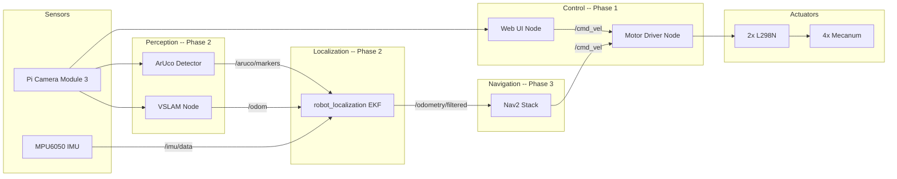

# Delivery Robot

Indoor autonomous delivery robot built on a Raspberry Pi 5 with ROS2 Jazzy. Uses monocular VSLAM + ArUco markers + IMU fusion for localization, Nav2 for path planning, mecanum drive for omnidirectional movement, and a web UI for manual/autonomous control.

## Hardware

| Component | Details |
|---|---|
| Computer | Raspberry Pi 5 (8 GB), Ubuntu 24.04, ROS2 Jazzy |
| Camera | Pi Camera Module 3 (IMX708, monocular) |
| Motor drivers | 2x L298N dual H-bridge boards |
| Drive | 4x DC motors with mecanum wheels |
| IMU | MPU6050 via I2C (not yet installed) |

See [HARDWARE.md](HARDWARE.md) for full GPIO pinout, wiring diagrams, and power connections.

## Architecture



## Package Layout

```
ros2_ws/src/delivery_robot/
  delivery_robot_bringup/    # launch files, config YAML
  delivery_robot_msgs/       # custom messages (ament_cmake)
  pi_camera_driver/          # rpicam-vid camera node (ament_python)
  motor_driver/              # L298N + mecanum kinematics (ament_python)
  robot_web_ui/              # web dashboard + WebSocket bridge (ament_python)
  aruco_detector/            # ArUco detection (Phase 2 stub)
```

| Package | Main source | Description |
|---|---|---|
| `pi_camera_driver` | `pi_camera_driver/camera_node.py` | Launches `rpicam-vid` in a clean env, publishes JPEG and raw Image topics |
| `motor_driver` | `motor_driver/motor_driver_node.py` | Subscribes to `/cmd_vel`, mecanum inverse kinematics, L298N PWM via `lgpio` |
| `robot_web_ui` | `robot_web_ui/web_ui_node.py` | aiohttp server on port 8080: MJPEG stream, WebSocket bridge, static frontend |
| `delivery_robot_msgs` | `msg/MotorStatus.msg` | `float32[4] duty_cycles`, `bool[4] active`, `string mode` |
| `delivery_robot_bringup` | `launch/bringup.launch.py` | Launches all Phase 1 nodes with YAML config |

## ROS2 Topics (Phase 1)

| Topic | Type | Publisher | Subscriber |
|---|---|---|---|
| `/camera/image_raw` | `sensor_msgs/Image` | pi_camera_driver | (Phase 2) |
| `/camera/image_raw/compressed` | `sensor_msgs/CompressedImage` | pi_camera_driver | robot_web_ui |
| `/cmd_vel` | `geometry_msgs/Twist` | robot_web_ui | motor_driver |
| `/motor_status` | `MotorStatus` | motor_driver | robot_web_ui |

## Build

```bash
cd ~/ros2_ws
source /opt/ros/jazzy/setup.bash
colcon build
source install/setup.bash
```

Incremental rebuild of a single package:

```bash
colcon build --packages-select <package_name>
```

## Run

```bash
~/start_robot.sh
```

This kills stale processes, then launches all nodes via `ros2 launch`. Ctrl+C to stop.

Open `http://<pi-ip>:8080` on your phone or laptop.

## Web UI Controls

| Input | Action |
|---|---|
| **W/A/S/D** | Forward / strafe left / back / strafe right |
| **Q/E** | Rotate left / right |
| **Shift** | Boost to full speed |
| **Speed slider** | Adjust max velocity (10-100%) |
| **Touch joystick** | Drag for omnidirectional control |
| **Gamepad left stick** | Translation (forward/back + strafe) |
| **Gamepad right stick** | Rotation |
| **Gamepad RT** | Boost |

## Configuration

All config lives in `delivery_robot_bringup/config/`:

| File | Contents |
|---|---|
| `motor_pins.yaml` | GPIO pin map, PWM frequency, `min_duty`, `max_speed`, watchdog timeout |
| `camera.yaml` | Resolution, framerate, JPEG quality, `publish_raw` toggle |

Edit and rebuild `delivery_robot_bringup` to apply changes.

## Known Quirks

- **libcamera/PiSP**: ROS2's `LD_LIBRARY_PATH` shadows the system libcamera. The camera node launches `rpicam-vid` in a minimal environment that strips all ROS2 paths. Do not change this without testing.
- **gpiochip4**: Pi 5 uses `gpiochip4` (RP1) for the 40-pin header, not `gpiochip0`. Set via `gpio_chip` param.
- **GPIO permissions**: The user must be in the `dialout` group. The launch script uses `sg dialout`.
- **ROS2 fixed-size arrays**: `float32[4]` and `bool[4]` fields must be assigned element-by-element in Python, not via list assignment.
- **JSON serialization**: ROS2 `float32`/`bool` types are numpy types. Convert with `float()`/`bool()` before passing to `json.dumps`.

## Further Reading

- [HARDWARE.md](HARDWARE.md) -- GPIO pinout, wiring, mecanum kinematics
- [ROADMAP.md](ROADMAP.md) -- phased development plan and open decisions
